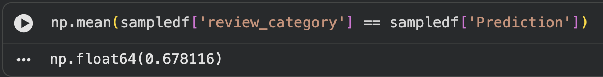

# SOSC 314 Research Project
This project aims to analyze Clash Royale reviews from the Google Play Store and use text as data methods to understand the motivation behind good and bad reviews. Our motivation to research Clash Royale comes from the app's relevance to our demographic and we hope our findings on this app can serve as inspiration for companies looking to improve their apps. Each week of this 7 week class, we will make progress on the project until we exhaust our methods for analyzing this data.
## Authors
**Zixiong Hu and Matthew Banko**
# Research Question
What are the primary factors behind a good/bad review of the popular mobile game Clash Royale?
# Data Source
We will use the Google Play Store for review data. The dataset can be found here (https://drive.google.com/file/d/1nlbmyhJU6A5Uu5pmJoR7VcBj5_-XobwB/view?usp=sharing).
# Dataset Information
review_id - This is Google's unique id assigned to every review.

content - This is the review description containing the words that will be analyzed.

score - This is the star rating assigned to the review.

at - This is the time the review was created at.

likes - This is the number of likes a review has received.

appversion - This is the app's version at the time the review was submitted.

# Google Colaboratory
https://colab.research.google.com/drive/1r0AIoHe4iQhcHq2k0ITj3KAilpcaQu9t?usp=sharing

# Planned Methods
* Sentiment Analysis
* Machine Learning Analysis
* Bag-of-Words Model

# Dataset Used
Our full dataset contains around 2 million reviews with around 1.7 million reviews at 3 stars or above and around 400k reviews at 2 stars or below. Due to RAM and processing constraints, we are unable to utilize this dataset in its entireity. Where possible, we try to utilize a random sample of 500k reviews from this full dataset. In our analysis with trigrams and bigrams, we were only able to analyze with a sample of 100k reviews because of RAM constraints.

# Lexicon Analysis
We used the natural language toolkit (NLTK)'s opinion_lexicon from nltk_corpus to analyze the lexical content of a random sample of 500k reviews. We wanted to predict the rating of a review based on the content of the review. We considered reviews with more positive words than negative words a positive review while reviews with more negative words than positive words were considered negative reviews. We then compared this result with the actual ratings of each review and found that our lexical approach classified around 67.8% of the reviews correctedly according to our definition. 

# Topic Model
We created topic modles on a 250k sample of both the positive and negative reviews. A positive review was defined as a review with a score of 3 stars or higher assigned to it. A negative review was defined as a review with a score of 2 stars or lower assigned to it. Both topic models showed a significant demand around the game's balance and fixing specific aspects of the game. The negative reviews topic model went more into depth about specific aspects that needed to be fixed, such as connectivity issues, matchmaking, and game balance isseus arising from certain cards and the monetization schemes.
